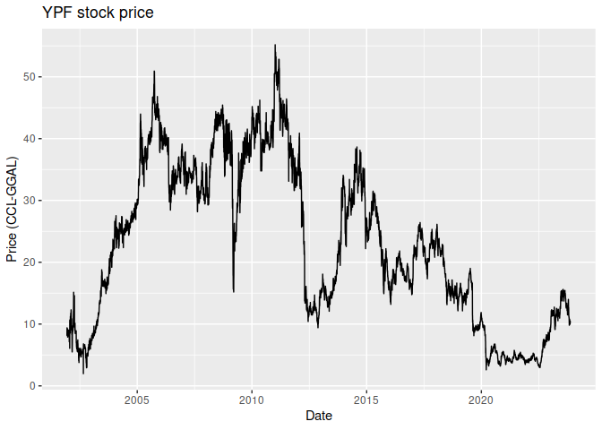

<!-- README.md is generated from README.Rmd. Please edit that file -->

# FinancialData

<!-- badges: start -->
<!-- badges: end -->

The goal of FinancialData is to provide convenient access in R some of
the various information generated by my
[broker-managment](https://github.com/maurogm/broker-management) Scala
project.

## Installation

You can install the FinancialData package locally by cloning the repo
and running:

``` r
devtools::install("path/to/FinancialData")
```

Alternatively, you can install the package from GitHub with:

``` r
devtools::install_github("maurogm/FinancialData")
```

## Example

Loading historic CCL data:

``` r
library(FinancialData)
ccl <- load_ccl("cclGGAL")
ccl
#>       currency_from currency_to       date       rate
#>    1:           ARS     USD-CCL 2001-12-07   1.246459
#>    2:           ARS     USD-CCL 2001-12-08   1.246459
#>    3:           ARS     USD-CCL 2001-12-09   1.246459
#>    4:           ARS     USD-CCL 2001-12-10   1.055556
#>    5:           ARS     USD-CCL 2001-12-11   1.107955
#>   ---                                                
#> 8011:           ARS     USD-CCL 2023-11-12 906.011854
#> 8012:           ARS     USD-CCL 2023-11-13 893.256014
#> 8013:           ARS     USD-CCL 2023-11-14 873.521959
#> 8014:           ARS     USD-CCL 2023-11-15 881.255230
#> 8015:           ARS     USD-CCL 2023-11-16 859.780776
```

Loading recent prices:

``` r
load_my_data("recent_prices") |> tail(10)
#>     exchange ticker       date localCurrency priceLocalCurrency
#>  1:     BCBA   GD30 2023-11-16           ARS           27001.00
#>  2:     BCBA  TECO2 2023-11-16           ARS             904.15
#>  3:     BCBA   BYMA 2023-11-16           ARS             579.00
#>  4:     BCBA   VALO 2023-11-16           ARS             120.00
#>  5:     BCBA   TRAN 2023-11-16           ARS             503.50
#>  6:     BCBA    EDN 2023-11-16           ARS             473.75
#>  7:     BCBA   ALUA 2023-11-16           ARS             856.50
#>  8:     BCBA   TX22 2022-01-21           ARS             196.50
#>  9:     BCBA   PAMP 2023-11-16           ARS            1239.00
#> 10:     BCBA   AE38 2023-11-16           ARS           23800.00
#>     homogeneousCurrency priceHomogeneousCurrency
#>  1:                 CCL               31.4045170
#>  2:                 CCL                1.0516053
#>  3:                 CCL                0.6734275
#>  4:                 CCL                0.1395705
#>  5:                 CCL                0.5856144
#>  6:                 CCL                0.5510126
#>  7:                 CCL                0.9961842
#>  8:                 CCL                0.8787513
#>  9:                 CCL                1.4410650
#> 10:                 CCL               27.6814749
```

Loading market data and converting currency:

``` r
library(ggplot2)
ypf_ars <- load_market_data("YPFD", "BCBA")
ypf_ccl <- market_data_to_ccl(ypf_ars, ccl)
ggplot(ypf_ccl, aes(x = datetime, y = lastPrice)) +
  geom_line() +
  labs(title = "YPF stock price", x = "Date", y = "Price (CCL-GGAL)")
```


